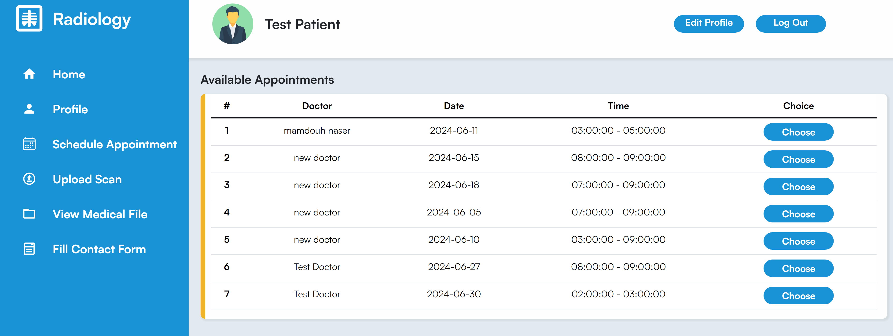
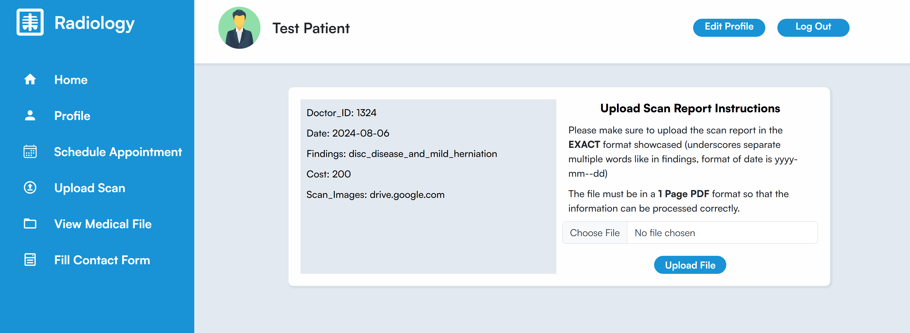
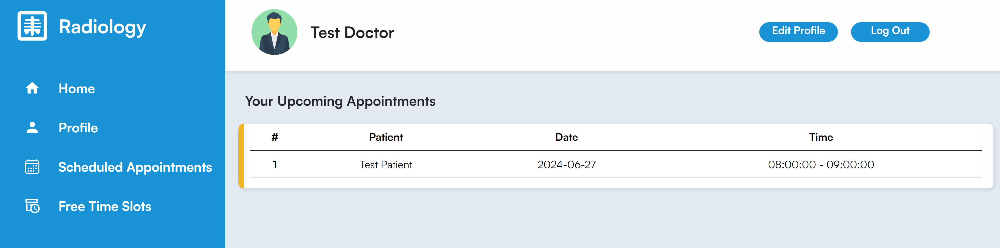
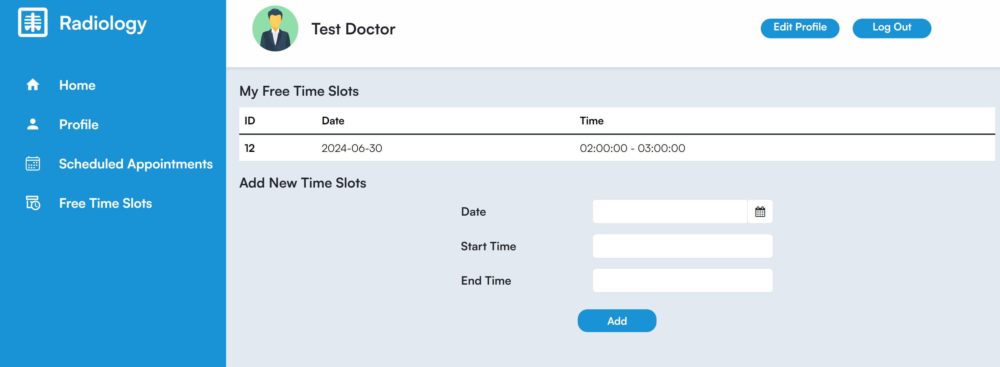
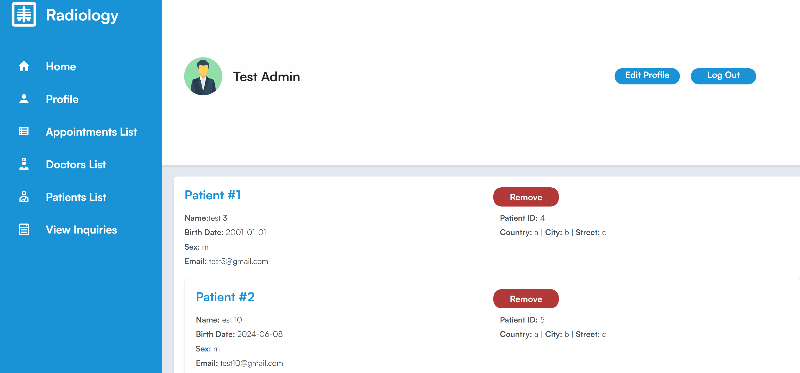
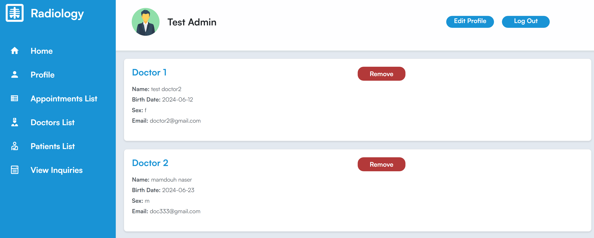
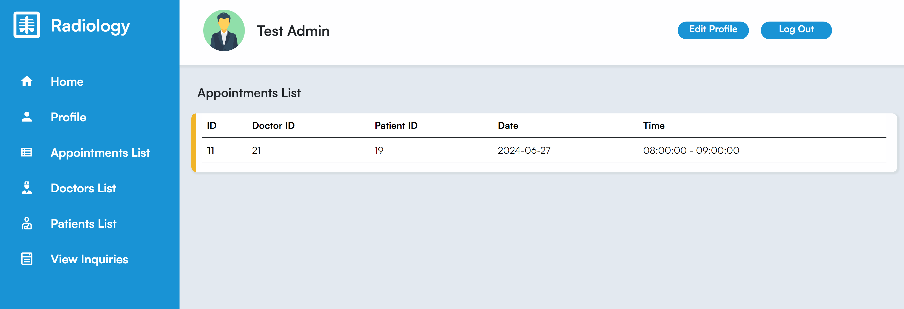
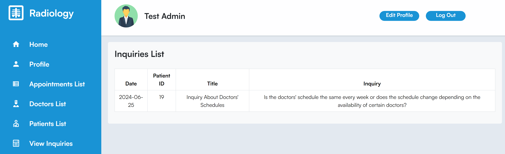
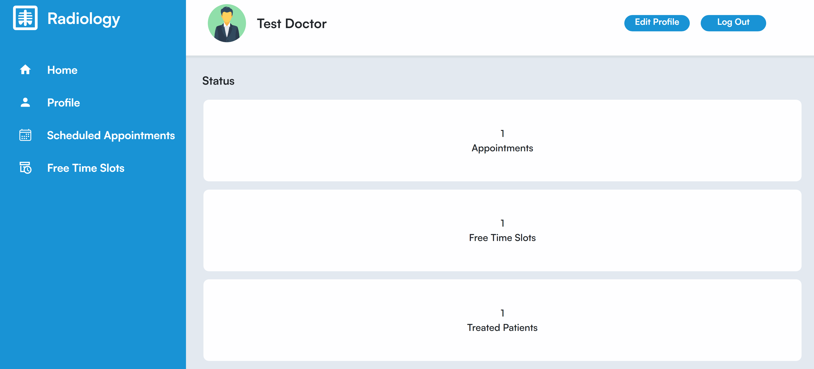
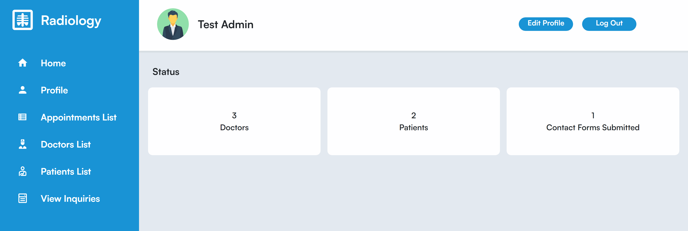

# Radiology Department Information System

## Live Demo
https://radiologyinformationsystem.pythonanywhere.com/

## Description

- Project For Database Class In Cairo University Faculty Of Engineering, Systems and Biomedical Engineering Department.
- Consists Of 3 Roles: Patient, Doctor, Adminstrator.
- Facilitates An Online Appointment System Between Doctors And Patients.
- Enables Patients To Upload Radiology Scan Reports.
- Allows Doctors To Input Free Time Slots Indicating Availablity For An Appointment.
- Introduces Inquriy System Between Patients And Adminstrators.

## Tech Stack Used
- Front End: HTML - CSS - JavaScript
- Back End: Flask
- Database: PostgreSQL

## Features

### Patients
- Schedule An Appointment
   

- Upload Radiology Scan Report

- View Medical File
  
.PNG>)
.PNG>)     

### Doctors
- View Scheduled Appointments
  

- Add / View Free Time Slots

### Admin
- View Patients Details   

- View Doctors Details 

- View Scheduled Appointments  

- View Patients Inquiries

| Patient Dashboard                             | Doctor Dashboard         | Admin Dashboard            |
| ----------------------------------------------| ---------------------| -----------------------------------------------|
| Email: `testpatient@gmail.com` | Email: `testdoctor@gmail.com` |   Email: `testadmin@gmail.com` | 
| Password: `1`                  |  Password: `1`                |  Password: `1`                |
| .PNG>) |   |  |

## Team Members

- Mostafa Ayman
- Louai Khaled
- Ali Younis
- Adham Khaled
- Ahmed Raafat
- Zyad Wael
